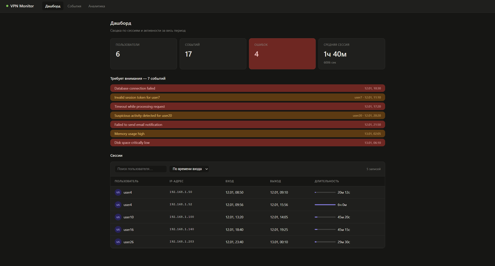

# VPN-VALIDATOR



Парсер и дашборд для анализа логов VPN-агента в формате syslog.

## Стек

- **Backend:** Node.js, TypeScript, Fastify, PostgreSQL
- **Frontend:** Next.js 15, TypeScript
- **Инфраструктура:** Docker Compose

## Запуск

### 1. База данных

```bash
docker-compose up -d
```

### 2. Переменные окружения

```bash
cp .env.example .env
```

### 3. Установка зависимостей

```bash
npm install
cd dashboard && npm install && cd ..
```

### 4. Парсер — создаёт таблицы и заливает данные из system.log

```bash
npm run parse
```

### 5. Сервер + дашборд одной командой

```bash
npm run dev
```

- API: http://localhost:3000
- Дашборд: http://localhost:3001

## Структура

```
src/
  parseUtils.ts   — парсинг строк syslog (фильтрация, regex, типы событий)
  parse.ts        — чтение файла и запись в БД
  server.ts       — Fastify API (sessions, events, stats)
  db.ts           — подключение к PostgreSQL, схема БД
dashboard/        — Next.js дашборд
system.log        — имитация логов VPN-агента
```

## Скрипты

| Команда | Описание |
|---------|----------|
| `npm run parse` | Парсинг логов и запись в БД |
| `npm run dev` | Запуск сервера и дашборда |
| `npm run server` | Только API сервер |
| `npm run dashboard` | Только дашборд |
| `npm test` | Запуск тестов |
| `npm run test:frontend` | Тесты фронтенда |
| `npm run test:all` | Все тесты (backend + frontend) |
| `npm run format` | Форматирование кода |

## API

| Метод | Путь | Описание |
|-------|------|----------|
| GET | /api/sessions | Список сессий с длительностью |
| GET | /api/events | Все события VPN-агента |
| GET | /api/stats | Сводная статистика |
